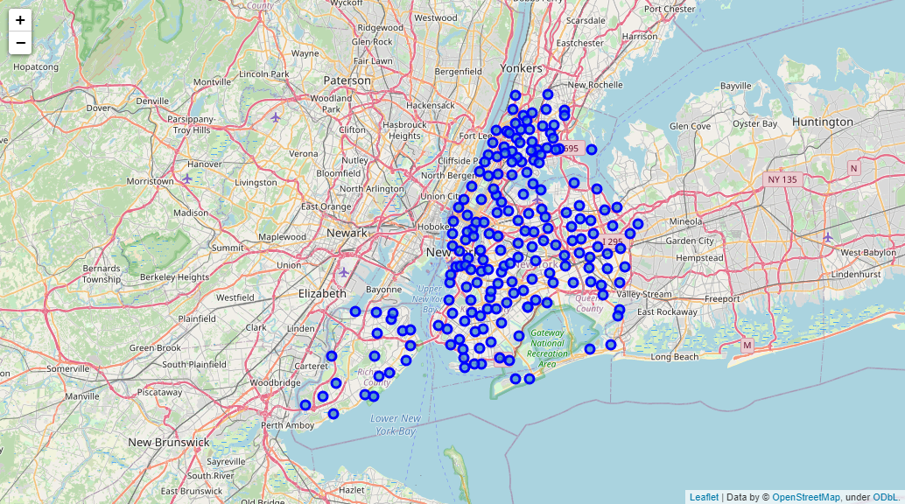

#  *The best locations where it pays to open restaurant in New York*

## Introduction/Business Problem

Restaurants are one of the most profitable sectors. However, according to one study, 60 percent close or change owners within the first year of operation, 80 percent fail within five years. Usually, restaurants fail with combination of problems that eventually lead to their closure. A bad location is one of the biggest reasons for restaurant failure. For example, a restaurant can sell the best "burger" in the world. If it is in a poor location (hidden, sparsely inhabited, blind and difficult to access) it will have to put in much more effort to fetch customers than to serve them.

In this context, how to define the best locations where it pays to open a restaurant?

Our objective is to recommend the best locations in New York city (well inhabited, close to subways, distant from existing restaurants) to open restaurant. We don’t distinguish the kind of restaurant.

The purpose of this whole exercise is for submission of the final capstone project for the "IBM Data Science" course on Coursera as well as to showcase my data science skills in the real-world application.

## Project Data Source

The data set required for this project provided from four different data sources: 

- Cordinates of the boundaries of Neighborhood Tabulation Areas (NTA) in New York from https://www1.nyc.gov/site/planning/data-maps/open-data/dwn-nynta.page

- Population Numbers By New York City Neighborhood Tabulation Areas (NTA) from https://data.cityofnewyork.us. The link of the CSV file https://query.data.world/s/zdkpdxvomgauu4r3jvymhy57mwtolg

- Location data of New York city subway station from https://data.cityofnewyork.us. The link of the CSV file is https://query.data.world/s/rttrjnk7raatdri6ialljpsucvbv5b
It will help to determine the minimal distance from a NTA to a subway station and the number of subways located in a given radius.

- Location data of restaurants provided from Foursquare API. It will help to determine the minimal distance from a restaurant to a NTA and the number of restaurants located in a given radius.

These data required high pre-processing in order to convert it to a working set, capable of handling machine learning algorithms and visualization operations that were implemented on it.

So, we generate a dataframe with a number of rows corresponding to NTA and columns are:
* longitude and latitude
* population
* minimal distance from a neighborhood location to a subway station
* number of subways located in a given radius
* minimal distance from a restaurant to a neighborhood location
* number of restaurants located in a given radius

The best locations are those where there is no or few restaurants, close to subway stations and well inhabited. 
NTA boundaries and their associated names may not definitively represent neighborhoods. We consider the center of NTA as districts in this exercise.

## Methodology

1. Data pre-processing

- Download data sets and load into a dataframe
  NTA are polygons or MultiPolygons. Our strategy is to determine the centeroid of these features which will be named "District"

- Create function that determines the coordinates of the Point representing the center of NTA

- Pre-Processing of the Subway stations dataset by extracting coordiantes of the stations

- Create function that calculate the minimal distance from a NTA to a restaurant, and to a subway
- Extracting nearest restaurants at a radius of 1 km

- Feature selection: All the dataframes are combined into a final data frame allowing to apply the classification algorithm
    * longitude and latitude
    * population
    * minimal distance from a neighborhood location to a subway station
    * number of subways located in a given radius
    * minimal distance from a restaurant to a neighborhood location
    * number of restaurants located in a given radius

2. Visualization
- Using Folium Library to visualize the locations of NTA in New York and for a particular borough

   

- Visualize the results of classification

3- Algorithm of Classification
- We use KMeans algorithm. 

# Result

# Discussion

As we can observe, the population of district have a high weight on the classification. The number of restaurants and subways are highly variable in each cluster. The cluster 1 has only one district and is the highly inhabited. Although it has 30 restaurants, the relationship between the population and the number of restaurant is good to allow installing an other restaurant. The cluster 2 contains the second category of well inhabited districts and some district such as Lower East Side has only 7 restaurants on a radius of 1 km. We cannot advise clustesr 0 and 3 which contain districts with few population and a lot of restaurants.

Our analysis did not take into account the repartition of population in a district. It based on the center of the Neighborhood Tabulation Areas. However, the results can be confirmed by the reality in Manhattan. As example, the cluster 3 which is not allowed, contains Manhattanville neighborhood which is few inhabited but has a lot of restaurants. It welcomes many tourists, likewise Gramercy.

### Future work

In terms of future work, I would be interested in applying the approach to other boroughs and also with other advanced machine learning techniques such as Density-based clustering (DBSCAN) to reinforce the clustering.

